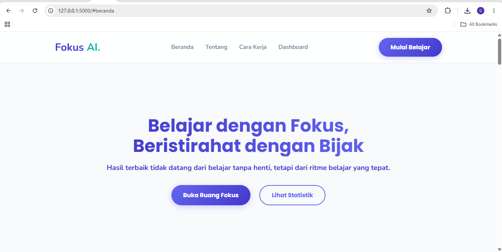
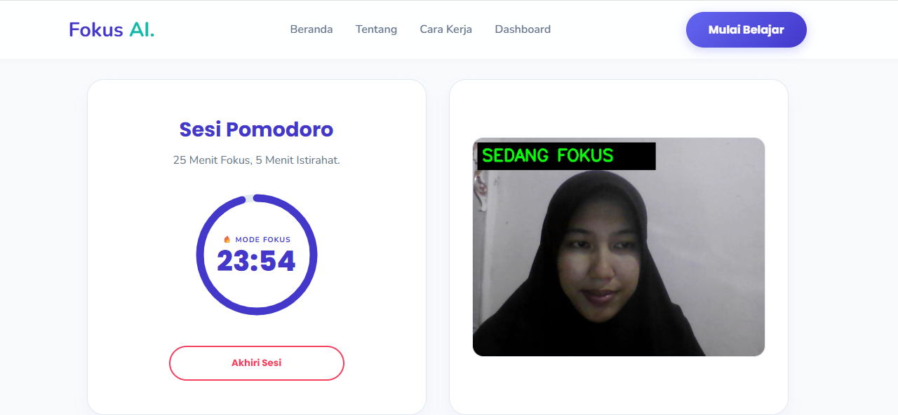
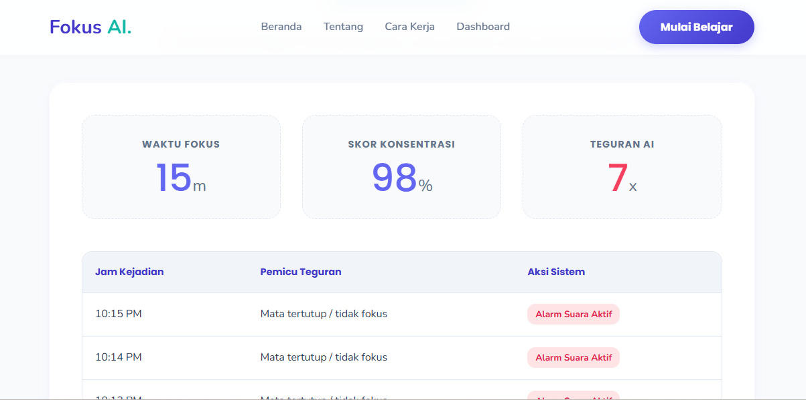

# Study Focus

Study Focus adalah aplikasi berbasis Python yang membantu pengguna tetap fokus saat belajar dengan memanfaatkan deteksi wajah dan mata secara real-time melalui webcam.

Aplikasi akan memantau kondisi mata pengguna. Jika mata tertutup dalam beberapa saat atau pengguna kehilangan fokus, sistem akan memberikan peringatan suara sebagai pengingat untuk kembali fokus.

## Fitur

- Deteksi wajah dan mata secara real-time
- Monitoring fokus pengguna saat belajar
- Peringatan suara saat mata tertutup atau fokus menurun
- Menggunakan webcam sebagai input utama
- Membantu meningkatkan konsentrasi selama belajar

## Teknologi

- Python (Flask)
- OpenCV
- MediaPipe
- NumPy
- HTML/CSS (Web Interface)

## Tangkapan Layar

### Tampilan Beranda


### Tampilan Ruang Fokus & Pomodoro


### Dashboard Statistik dan Riwayat



## 🚀 Cara Menjalankan

1. Clone repository

```bash
git clone https://github.com/gadizafauzi/study-focus.git
cd study-focus
```

2. Install dependensi

```bash
pip install -r requirements.txt
```

3. Jalankan aplikasi

```bash
python main.py
```

## Tujuan Proyek

Proyek ini dibuat untuk mempelajari penerapan Computer Vision dan Artificial Intelligence dalam membantu pengguna menjaga fokus dan konsentrasi saat belajar.

## Pengembang

**Gadiza Fauzi**  
Mahasiswa Teknologi Rekayasa Perangkat Lunak (TRPL)
